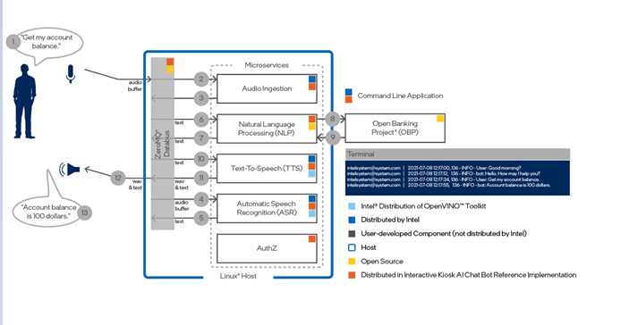

# Conversational AI Chat Bot

- [Conversational AI Chat Bot](#conversational-ai-chat-bot)
	- [Introduction](#introduction)
		- [Block Diagram](#block-diagram)
		- [Prerequisites](#prerequisites)
		- [Hardware](#hardware)
		- [Recommended Domain Knowledge](#recommended-domain-knowledge)
	- [Getting Started](#getting-started)
		- [Step 1: Clone the repository](#step-1-clone-the-repository)
		- [Step 2: Build the reference implementation](#step-2-build-the-reference-implementation)
		- [Step 3: Start the reference implementation](#step-3-start-the-reference-implementation)
		- [Step 4: Dive In](#step-4-dive-in)
	- [General Guidance](#general-guidance)
		- [How to build service individually](#how-to-build-service-individually)
	- [Quickstart](#quickstart)
			- [*Update the environment variables.*](#update-the-environment-variables)
			- [Run wave-ingestion](#run-wave-ingestion)
			- [Run Live Speech Ingestion](#run-live-speech-ingestion)
	- [Expanding the Reference Implementation](#expanding-the-reference-implementation)
	- [Release Notes](#release-notes)

## Introduction

This guide helps you build and run the **Conversational AI Chat Bot** Reference Implementation.

Upon completing the steps in this guide, you will be ready to integrate services to build your own complete solution.

### Block Diagram



### Prerequisites

The following items are required to build the `Conversational AI Chat Bot`. You will need additional hardware and software when you are ready to build your own solution.

- [Ubuntu 18.04](https://releases.ubuntu.com/18.04.4/)
- [Docker >= 19.03.5](https://docs.docker.com/install/)
- [Docker Compose >= 1.25.3](https://docs.docker.com/compose/)
- [Git](https://git-scm.com/)
- [GNU make](https://www.gnu.org/software/make/)

Here's how to install `git`, `curl`, and `make` on an Ubuntu 18.04 system - other operating systems may vary:

```bash
sudo apt-get update -y
sudo apt-get install -y git curl build-essential
```

### Hardware

- 8th Generation (and above) Intel® Core™ Processor, 32GB RAM and 100GB of HDD.
- ReSpeaker™ or equivalent USB Mic Array
- Auxiliary (AUX) Port Speaker or USB speaker
- Network with speed greater than 60 mbps preferable while building the docker images.

### Recommended Domain Knowledge

- [Open Bank Project](https://www.openbankproject.com/)
- [OpenVINO™ Toolkit](https://docs.openvinotoolkit.org/latest/index.html)

To use the chatbot, we need the credentials of an **Open Bank Project** compatible server. This reference implementation uses a sandbox server hosted  [here](https://apisandbox.openbankproject.com). For this demo, [create credentials here](https://apisandbox.openbankproject.com/consumer-registration ). 

## Getting Started

### Step 1: Clone the repository

```bash
git clone https://github.com/intel-innersource/applications.infrastructure.eoe.conversational-ai

```


### Step 2: Build the reference implementation

You must build the provided component services and create local docker images. To do so, run:

```

$ sudo chmod a+x setup
# set env variables
$ source <repo-root>/setenvvars.sh
$ ./setup build
```

NOTE: This command may take a while to run depending on your internet connection and machine specifications.

For development or a quick demo, you can follow the [quickstart instructions here.](#quickstart)

### Step 3: Start the reference implementation


The solution is to be deployed on a single node docker swarm. It stores the keys as docker secrets. 

1. **Create a docker swarm**

This is a one time step.
```bash
# Check your ip
$ ip=`hostname -I | awk '{print $1}'`
$ echo "The ip of machine is $ip"
$ docker swarm init --listen-addr $ip
```

2. **Create a directory to hold unix sockets.**

This is a one time step. Assume the path you chose is `~/ipc_sockets`. Follow these steps to create the directory and set its permissions.


```bash
$ mkdir -p ~/ipc_sockets
$ cd ~/ipc_sockets && export SOCKET_DIR=`pwd` && cd -
# Change the ownership of the path
$ sudo chown 800:1102 $SOCKET_DIR
```

3. **Create Secrets**

This step creates secrets and keys. This has to be run preferably at every run.

```bash
./create_secrets.sh
```

4. **Run the compose file via make**

Set the required env variables. `TAG` and `SOCKET_DIR`. 

TAG=1.0 and SOCKET_DIR is the absolute path of the socket directory we created in the step 2.

```bash
cd ~/ipc_sockets && export SOCKET_DIR=`pwd` && cd -
export TAG=1.0

# choose asr
export ASR_IMAGE=kaldi_asr
# or
# export ASR_IMAGE=deepspeech_asr

# For wave audio file ingestion
# make -e run

# OR

# For recording via mic, we need to run this command
make -e run_respeaker

# to stop

make -e stop 

#OR
make -e stop_respeaker

```


### Step 4: Dive In

All of the core components of  **Conversational AI Chat Bot** are up and running, and you are ready to begin going through the following phases.

- [Login](docs/login.md): Login Using openbankproject credentials

- [Phase 1](docs/configuration.md#recording-from-microphone): Record From Microphone


## General Guidance

After completing the steps in the Getting Started section, it may be helpful to read through the remainder of this document for some further guidance on the **Conversational AI Chat Bot** reference implementation.

Please go through this link for an overview of the services used in this solution.

- [overview of services](docs/overview.md)
- [security overview](docs/security.md)


### How to build service individually

```bash

# build deepspeech
make deepspeech_asr

# build kaldi asr
make kaldi_asr

# build huggingface asr
make huggingface_asr

# build quartznet_asr
make quartznet_asr

# build audio ingestion for wave files
make audio_ingestion

# build audio ingestion to record from mic
make audio_ingestion2

# build tts
make tts

# build authz
make authz

# build nlp_app
make nlp_app

# build rasa_action
make rasa_action_server

```

## Quickstart

Use these steps to quickly start with the software. You need to create login credentials first as discussed here. [Login](docs/login.md)

This method is recommended only for development or a quick demo. This requires the user to enter credentials via env variables.  

There are two ways to run the application:

**1. Wav File Ingestion**: A quick test of the RI to illustrate how it responds to speech. Use this method to see the RI run with sample audio files. Use a speaker or headphones as the output device or monitor the log files.


**2. Live Speech Ingestion**: An interactive test of the RI that involves speaking words and phrases into a microphone or mic array. Use this method with Seeed ReSpeaker or another device as the input mic. Use a speaker or headphones as the output device or monitor the log files. 

#### *Update the environment variables.*

NOTE: *The default ASR(speech recognition) set via `setenvvars.sh` script is quartznet_asr, in case the user want a different asr, user can edit the `ASR_IMAGE` variable in setenvvarsh.sh to any one of these {kaldi_asr, deepspeech_asr, hugginface_asr.
Additionally, in case of multiple output devices, we can choose the specific output device by setting the `ALSA_CARD` value. The available card options can be checked via `aplay -l`.* 
```bash
# install alsa-utils, if not available
sudo apt-get install alsa-utils
aplay -l
# this lists the sound cards
export ALSA_CARD=<alsa sound device>
or
export ALSA_CARD=''
# for default device

```

Set env variables.
```bash
# set env variables
source <repo-root>/setenvvars.sh
# This script is interactive and will prompt the user for credentials and alsa_card value.

```


#### Run wave-ingestion
*Run the software using pre-recorded queries.* 

```bash
./setup run wave_ingestion
```

The responses of the bot would be heard in the speaker in a short while.

*Stop the software.*

```bash
./setup stop wave_ingestion
```

#### Run Live Speech Ingestion

Make sure you have connected a working microphone to the setup.

*Run the live speech*
```
./setup run speech_ingestion
```

*Stop Live Speech*
```
./setup stop speech_ingestion
```

## Expanding the Reference Implementation

The reference implementation you created is not a complete solution. It provides the base components for creating a framework to run an OpenVINO powered **Conversational AI Chat Bot**. This section provides information about components you might want to include or replace or change.


| Component     | Description                                                  |
| ------------- | ------------------------------------------------------------ |
| Authz Service | Currently we need to use linux commandline for login It doesn't represent an actual banking use case login. It can be replaced or extended to give a UI/web UI based interface for login. |

## Release Notes

Find the [release notes here](docs/release_notes.md).
