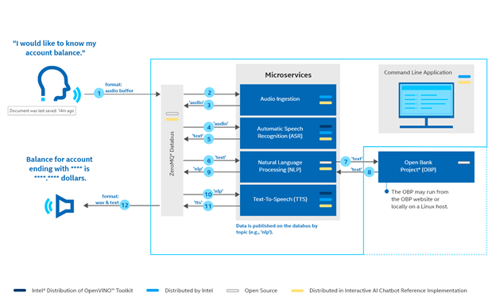

# DISCONTINUATION OF PROJECT #  
This project will no longer be maintained by Intel.  
This project has been identified as having known security escapes.  
Intel has ceased development and contributions including, but not limited to, maintenance, bug fixes, new releases, or updates, to this project.  
Intel no longer accepts patches to this project.  


# Conversational AI Chat Bot

- [Conversational AI Chat Bot](#conversational-ai-chat-bot)
	- [Introduction](#introduction)
		- [Block Diagram](#block-diagram)
		- [Prerequisites](#prerequisites)
		- [Hardware](#hardware)
		- [Recommended Domain Knowledge](#recommended-domain-knowledge)
	- [Get Started](#get-started)
		- [Step 1: Connect the Devices](#step-1-connect-the-devices)
		- [Step 2: Clone the repository](#step-2-clone-the-repository)
		- [Step 3: Build the reference implementation](#step-3-build-the-reference-implementation)
		- [Step 4: Start the reference implementation and set configuration](#step-4-start-the-reference-implementation-and-set-configuration)
		- [Step 5: Run the reference implementation](#step-5-run-the-reference-implementation)
			- [Wav File Ingestion (recommended for first-time configuration)](#wav-file-ingestion-recommended-for-first-time-configuration)
			- [Live Speech Ingestion](#live-speech-ingestion)
		- [Step 6: Stop the reference implementation](#step-6-stop-the-reference-implementation)
		- [Step 7: Remove the reference implementation](#step-7-remove-the-reference-implementation)
	- [References](#references)
		- [Restart the ALSA Firmware](#restart-the-alsa-firmware)
		- [General Guidance](#general-guidance)
		- [Expanding the Reference Implementation](#expanding-the-reference-implementation)
		- [Mandatory local repo configurations](#mandatory-local-repo-configurations)
	- [Release Notes](#release-notes)

## Introduction

This guide helps you build and run the **Conversational AI Chat Bot** Reference Implementation.

Upon completing the steps in this guide, you will be ready to integrate services to build your own complete solution.

### Block Diagram



### Prerequisites

The following items are required to build the `Conversational AI Chat Bot`. You will need additional hardware and software when you are ready to build your own solution.

- [Ubuntu 18.04](https://releases.ubuntu.com/18.04.4/) or [Ubuntu 20.04](https://releases.ubuntu.com/20.04/)
- 8th Generation (and above) Intel® Core™ Processor, 32GB RAM and 100GB of free space on HDD
- [Docker >= 19.03.5](https://docs.docker.com/install/)
- [Docker Compose >= 1.25.3](https://docs.docker.com/compose/)
- [Git](https://git-scm.com/)
- [GNU make](https://www.gnu.org/software/make/)

Here's how to install `git`, `curl`, and `make` on an Ubuntu 18.04 system - other operating systems may vary:

```bash
sudo apt-get update -y
sudo apt-get install -y git curl build-essential
```

### Hardware

- 8th Generation (and above) Intel® Core™ Processor, 32GB RAM and 100GB of HDD.
- ReSpeaker™ or equivalent USB Mic Array
- Auxiliary (AUX) Port Speaker or USB speaker
- Network with speed greater than 60 mbps preferable while building the docker images.

### Recommended Domain Knowledge

- [Open Bank Project](https://www.openbankproject.com/)
- [OpenVINO™ Toolkit](https://docs.openvinotoolkit.org/latest/index.html)

To use the chatbot, we need the credentials of an **Open Bank Project** compatible server. This reference implementation uses a sandbox server hosted  [here](https://apisandbox.openbankproject.com). For this demo, [create credentials here](https://apisandbox.openbankproject.com/consumer-registration ).

## Get Started

### Step 1: Connect the Devices
Before installing the application, connect input and output devices on your Linux host (i.e., the system on which the RI is running).
1.	On the Linux host, connect a wired microphone and a wired speaker.
2.	Open Settings with the nine-button menu, bottom right of screen, and choose Sound. If a sound application is running, it will appear in this dialog. Close any sound applications (e.g., media players, YouTube*).

#### Identify Audio Devices
Use the aplay command to obtain the name of the connected, available devices.
1.	Open a terminal and run the command:
	```bash
	aplay -l
	```


	
2.	Notice the name of available devices.

In the Figure above, the name of the SeeedStudio ReSpeaker device is ArrayUAC10.  The name of Jabra* sound card is USB. The list of available recording and playback devices in [Step 4: Start the reference implementation and set configuration](#step-3-start-the-reference-implementation-and-set-configuration) will contain USB and ArrayUAC10 as options.


### Step 2: Clone the repository

```bash
git clone https://github.com/intel/conversational-ai-chatbot

```


### Step 3: Build the reference implementation

You must build the provided component services and create local docker images. To do so, run:

```bash
./setup install
```

**NOTE**: This command may take a while to run depending on your internet connection and machine specifications.

### Step 4: Start the reference implementation and set configuration


The solution is to be deployed on a single node docker swarm. It stores the keys as docker secrets.

```bash
./setup start
```

Next, you’ll set the configuration options:

1.	Use output from aplay to choose from the list of available recording and playback devices when prompted with Choose a recording device and a playback device to test. Enter the device name for the recording and playback devices and then press Enter.

	

- **NOTE**: **The names are case sensitive**.

2.	To test device compatibility, press *enter* key to begin recording. The application records for 20 seconds. The recording will play automatically after the 20 seconds has elapsed.
	- If you hear playback, the solution has found your device. Follow the prompts and enter yes. Continue with step 4.
	- If you indicate you don’t hear playback with no, the installation process will stop. Connect another device and go back to the start of installation, Build and Install.
	- If you don’t have another device or the device(s) you’ve tried do not work, see [Restart the ALSA Firmware](#restart-the-alsa-firmware).
3.	Set the ingestion type when prompted by entering the corresponding number.
4.	Set the ASR model when prompted by entering the corresponding number.


	
- **NOTE**: Wave ingestion (enter 1) is recommended to start and test the RI. Later sections cover Live Speech Ingestion.

5.	For OBP-related configuration, [Login](docs/login.md): Login Using openbankproject credentials

6.	The build will begin after configuration end.
- **NOTE**: The configuration uses the host system’s proxy.

- **NOTE**: A first time build and install may take up to 45 minutes to complete.

- **WARNING**: If you configured the solution for wav file ingestion, the audio starts as soon as the message Starting Chatbot Services appears. Adjust volume of speaker for audio response of chatbot services.


### Step 5: Run the reference implementation

#### Wav File Ingestion (recommended for first-time configuration)
Ingestion starts as soon as the software installation has concluded. The software cycles through the audio input files and plays responses to the audio queries until you stop the software or switch run methods.

**NOTE**: You cannot provide speech input to the RI while running Wav File Ingestion.

You’ll hear these NLP responses:
```
Welcome to the future of banking.
The balance for the saving account ending in ____ is ____ rupees.
You will find one near ____ Road.
You have two savings accounts with our bank.
```
To listen:
- Listen to output through the speaker device you chose. You will hear the NLP responses listed above.

To read the log files:
- To see input and output speech in the log files, open two terminal windows.
- In a terminal(s), list the container IDs:
	```
	docker ps --format "table {{.Image}}\t{{.Status}}\t{{.ID}}"
	```
- View the log by running docker logs with the NLP container ID:
	```
	docker logs -f <NLP container-ID>
	```
- View the log by running docker logs with the ASR container ID:
	```
	docker logs -f <ASR container-ID>
	```

#### Live Speech Ingestion

The application listens for speech input as soon as installation concludes. The instructions below outline how to speak to the application, read responses, or listen to responses through a speaker.

To speak:
- Start by waking the application with the wake word, a word that alerts the RI to start listening for speech. The wake word is reSpeaker (ree-spee-kr). Say, “ReSpeaker [pause], good morning.”

To listen:
- Listen to output through the speaker device you chose.

To read the log files:
- To see input and output speech in the log files, open two terminal windows.
- In a terminal(s), list the container IDs:
	```
	docker ps --format "table {{.Image}}\t{{.Status}}\t{{.ID}}"
	```
- View the log by running docker logs with the NLP container ID:
	```
	docker logs -f <NLP container-ID>
	```
- View the log by running docker logs with the ASR container ID:
	```
	docker logs -f <ASR container-ID>
	```


### Step 6: Stop the reference implementation

The solution can be stopped using following command.

```bash
./setup stop
```

### Step 7: Remove the reference implementation

To remove built docker images, use below command

```bash
./setup uninstall
```


## References

### Restart the ALSA Firmware

1.	If the recording test in Build and Install fails, restart the Advanced Linux Sound Architecture (ALSA) firmware:
	```bash
	pulseaudio -k && sudo alsa force-reload
	```
2.	Rebuild the application. See Build and Install.
**NOTE**: If the build fails after restarting the ALSA firmware, the device is not supported.


### General Guidance

After completing the steps in the Getting Started section, it may be helpful to read through the remainder of this document for some further guidance on the **Conversational AI Chat Bot** reference implementation.

Please go through this link for an overview of the services used in this solution.

- [overview of services](docs/overview.md)
- [security overview](docs/security.md)


### Expanding the Reference Implementation

The reference implementation you created is not a complete solution. It provides the base components for creating a framework to run an OpenVINO powered **Conversational AI Chat Bot**. This section provides information about components you might want to include or replace or change.


| Component     | Description                                                  |
| ------------- | ------------------------------------------------------------ |
| Authz Service | Currently we need to use linux commandline for login It doesn't represent an actual banking use case login. It can be replaced or extended to give a UI/web UI based interface for login. |

### Mandatory local repo configurations:

User needs to update below repo specific git configurations immediately after cloning this repository.
`cd <current-repo-path>`
`git config core.hooksPath .githooks`


## Release Notes

Find the [release notes here](docs/release_notes.md).
